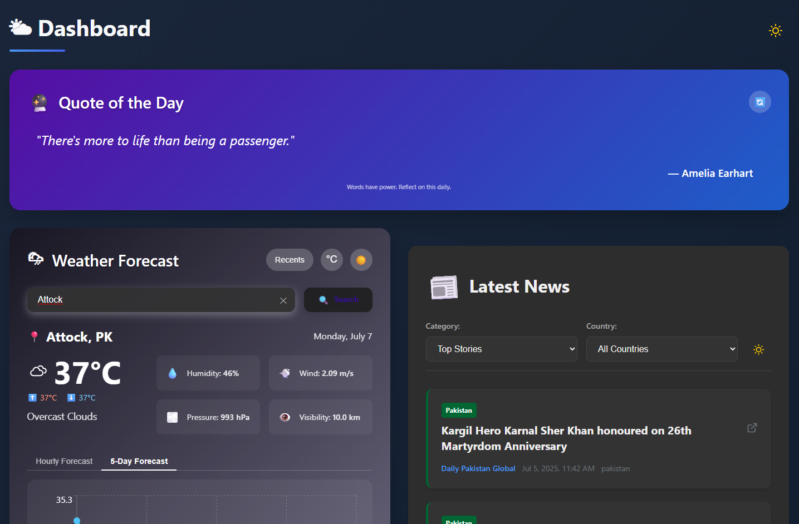

# 🌦 Weather News App

A React-based web application that provides:

- 🌤 Real-time weather updates
- 📰 Latest global and Pakistani news
- 💡 A daily inspirational quote

Built using React, Express, and public APIs (OpenWeather, GNews, and Quotes).

---

## 📸 Features

- 🌦 **Live Weather**: Search and view current weather for any city (via OpenWeather API)
- 📰 **Top Headlines**: Displays latest news using GNews API
  - ✅ Always shows at least **one Pakistani article** on page 1
  - 🔁 Pagination for news (2 pages max)
- 💬 **Daily Quote**: Shows one inspirational quote every day
- ⚠ Graceful error handling (API failures, missing data, etc.)
- 📦 Easy to configure via `.env`

---

## 🛠 Tech Stack

- **Frontend**: React + CSS
- **Backend**: Express (Node.js)
- **APIs Used**:
  - [OpenWeather](https://openweathermap.org/api)
  - [GNews](https://gnews.io/)
  - [ZenQuotes.io](https://zenquotes.io/) or similar for daily quotes
- **Deployment**: GitHub + Vercel (optional Express backend)

---

## 📸 Preview



## 🧪 Local Setup Instructions

### 1. Clone the repository

```bash
git clone https://github.com/YOUR_USERNAME/weather-news.git
cd weather-news
````

### 2. Install dependencies

```bash
npm install
```

### 3. Create `.env` file

In the root folder, create a `.env` file:

```env
REACT_APP_WEATHER_KEY=your_openweather_api_key
REACT_APP_GNEWS_KEY=your_gnews_api_key
```

> You can get these keys for free by signing up at:
>
> * [https://openweathermap.org/](https://openweathermap.org/)
> * [https://gnews.io/](https://gnews.io/)

### 4. Start the development server

```bash
npm start
```

Then open [http://localhost:3000](http://localhost:3000)

---

## 📂 Project Structure

```
weather-news/
├── public/
├── src/
│   ├── components/
│   │   ├── Weather.jsx
│   │   ├── News.jsx
│   │   └── Quote.jsx
│   └── styles/
│       ├── weather.css
│       ├── news.css
│       └── quote.css
├── server.js
├── .env
├── package.json
├── preview.png
└── README.md
```

---

## 🌐 Deploy to Vercel

1. Push this project to a GitHub repository
2. Go to [vercel.com](https://vercel.com/)
3. Import your GitHub repo
4. In Vercel’s settings, add environment variables:

   * `REACT_APP_WEATHER_KEY`
   * `REACT_APP_GNEWS_KEY`
5. Deploy 🎉

---

## 🙏 Acknowledgements

* [OpenWeather API](https://openweathermap.org/)
* [GNews API](https://gnews.io/)
* [ZenQuotes API](https://zenquotes.io/)
* [Vercel](https://vercel.com/) for hosting

---

## 📜 License

This project is licensed under the MIT License.

```

## Author

**Haider**
Built with ❤️ using React + Express
[GitHub Profile](https://github.com/HSA-ATTOCK)

````